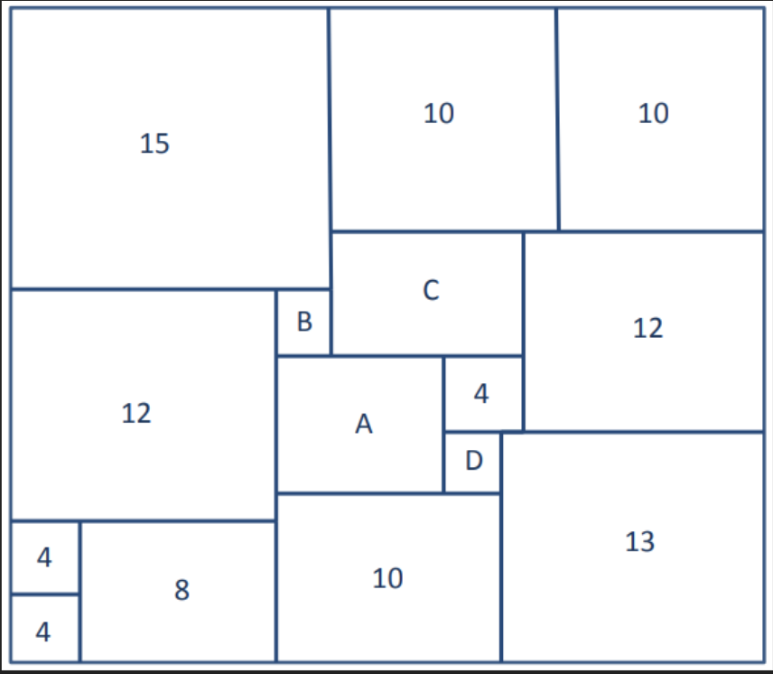

[drag=100, drop=center, flow=column]





---

[drag=99, drop=center, flow=column]
# Small Basic - Lesson 3 
## Input / Output

**ASPIRE to:**
apply the methods of input and output in a variety of scenarios

**CHALLENGE to:**
construct a program that allows the user to input and output data
---
[drag=50, drop=left, flow=column]
## Starter

**Can you solve the following problem?**


- Each shape contained within the largest square is also a Square.


- The number in each square gives the length of its sides.

- What are the values of A, B, C and D?


-- Speaker notes
Answers: 
A = 7
B = 3
C = 8
D = 3
---

[drag=99, drop=center, flow=column]
## Small Basic

Everything we have done in Small Basic so far has been using turtle to draw shapes. We are now going to look at creating text based programs.


```basic
TextWindow.WriteLine(“Text”)
```
This command will display the text inside the speech marks on screen.
```basic
TextWindow.Read()
```
This command will allow the user to enter something into the program
```basic
TextWindow.WriteLine(“Hello World”)
```
---
[drag=99, drop=center, flow=column]
# Slide 4

## Task

Open the Small Basic website at:

http://computing.outwood.com/smallbasic

Complete Task 1 under lesson 3, can you change the colour of the foreground/background?

**Extension:**

Can you use TextWindow.Write() to change the colour of your text like shown below?
---
[drag=99, drop=center, flow=column]
# Slide 5
## Progress Check
**On your mini-whiteboards answer the following questions:**

What would the following code do?
```basic
TextWindow.WriteLine(“Welcome to Computer Science”)
```
-- Speaker Notes
Answer:
It would say Welcome to Computer Science on screen
---
[drag=99, drop=center, flow=column]
# Slide 6
## Progress Check
**On your mini-whiteboards answer the following questions:**
What would the following code do?
```basic
TextWindow.ForegroundColor = “Green”
TextWindow.WriteLine(“This is Green”)
```
-- Speaker Notes
Answer:
It would say This is Green with the text being green
---
[drag=99, drop=center, flow=column]
# Slide 7
## Progress Check
**On your mini-whiteboards answer the following questions:**

What would the following code do?
```basic
TextWindow.BackgroundColor = “Green”
TextWindow.WriteLine(“This is Green”)
```
-- Speaker Notes
Answer:
It would say This is Green with the background colour being green
---
[drag=99, drop=center, flow=column]
# Slide 8
## Progress Check
**On your mini-whiteboards answer the following questions:**

What would the following code do?
TextWindow.WriteLine(“This is Green”)
```basic
TextWindow.ForegroundColor = “Green”
```
-- Speaker Notes
Answer:
It would say This is Green but the text colour would be the default colour
---
[drag=99, drop=center, flow=column]
# Slide 9
## Progress Check
**On your mini-whiteboards answer the following questions:**

What is the difference between:
```basic
TextWindow.Write()```

&
```basic
TextWindow.WriteLine()?
```
-- Speaker Notes
Answer:
TextWindow.Write will not start a new line with the code that follows.
TextWindow.WriteLine will start a new line after the text in the brackets
---
[drag=99, drop=center, flow=column]
## Taking Input

So you now know how to display text on screen, but what about taking input from the user, you can do this will the following command.
```basic
TextWindow.Read()
```
This will create a flashing cursor so the user can type something in.

## Storing the Input
It is really important that when you use this command, you store what they type somewhere. To do this you use a variable. This is a name that will be used to refer to what they have entered, e.g.:

```basic
TextWindow.WriteLine(“Enter your name: “)
name = TextWindow.Read()
TextWindow.WriteLine(“Your name is “ + name)
```
-- Speaker Notes
Explain what this code would do.
---
[drag=99, drop=center, flow=column]
# Slide 11
## Task

Try to complete Task 2 - Shopping List.

Use the code that is given to get started and then continue creating the program so it works like the example shown.

## Done?
Screenshot your code and add it to your programming diary
---
[drag=99, drop=center, flow=column]
Slide 12
## Task


Try to complete Task 3 - Chat Bot

Use the code that is given to get started and then continue creating the program so it works like the example shown.

## Done? 
Screenshot your code and add it to your programming diary
---
[drag=99, drop=center, flow=column]
# Slide 13
## Plenary

**On your mini-whiteboards answer the following questions:**

What would the following program display if the user entered Pizza
``basic
TextWindow.WriteLine(“What is your favourite food?”)
food = TextWindow.Read()
TextWindow.WriteLine(“You said “ + food + “ is your fav”)
```
-- Speaker Notes
Answer:
It would display You said Pizza is your fav
---
# Slide 14
## Plenary

**On your mini-whiteboards answer the following questions:**

Why would this program not make sense?
``basic
age = TextWindow.Read()
TextWindow.WriteLine(“What is your age?”)
```
---
[drag=99, drop=center, flow=column]
# Slide 15
## Plenary
On your mini-whiteboards answer the following questions:

What is wrong with this code? Rewrite it so that it would work
```basic
Text.WriteLine(“What day is it?)
TextWindow.Read()
TextWindow.Write”Today is “ + day)
```
-- Speaker Notes
Answer:
TextWindow.WriteLine(“What day is it?”)
day = TextWindow.Read()
TextWindow.Write(“Today is “ + day)

