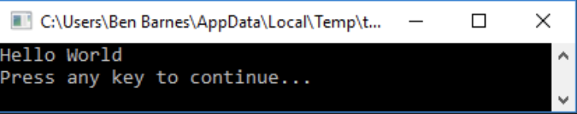
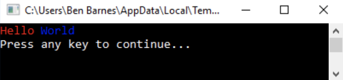

[drag=100, drop=center, flow=col]

[drag=50, drop=left, flow=col]
### Starter


```basic 
Turtle.Move(100)
Turtle.PenUp()
Turtle.Turn(90)
Turtle.Move(50)
Turtle.Turn(90)
Turtle.PenDown()
Turtle.Move(100)
Turtle.PenUp()
Turtle.Turn(270)
Turtle.Move(50)
Turtle.PenDown()
Turtle.TurnLeft()
Turtle.Move(100)
```

---

[drag=99, drop=center, flow=stack]
# Small Basic - Lesson 3 
## Input / Output

**ASPIRE to:**
apply the methods of input and output in a variety of scenarios

**CHALLENGE to:**
construct a program that allows the user to input and output data
---

[drag=100, drop=center, flow=col]

## Small Basic

Everything we have done in Small Basic so far has been using turtle to draw shapes. We are now going to look at creating text based programs.


```basic
TextWindow.WriteLine(“Text”)
```
This command will display the text inside the speech marks on screen.
```basic
TextWindow.Read()
```
This command will allow the user to enter something into the program
```basic
TextWindow.WriteLine(“Hello World”)
```




---
[drag=99, drop=center, flow=column]


## Task

Open the Small Basic website at:

### http://computing.outwood.com/smallbasic

Complete Task 1 under lesson 3, can you change the colour of the foreground/background?

**Extension:**

Can you use TextWindow.Write() to change the colour of your text like shown below?




---
[drag=99, drop=center, flow=col]

## Progress Check
**On your mini-whiteboards answer the following questions:**

What would the following code do?
```basic
TextWindow.WriteLine(“Welcome to Computer Science”)
```
---
[drag=99, drop=center, flow=col]

## Progress Check
**On your mini-whiteboards answer the following questions:**
What would the following code do?
```basic
TextWindow.ForegroundColor = “Green”
TextWindow.WriteLine(“This is Green”)
```
---
[drag=99, drop=center, flow=column]

## Progress Check
**On your mini-whiteboards answer the following questions:**

What would the following code do?
```basic
TextWindow.BackgroundColor = “Green”
TextWindow.WriteLine(“This is Green”)
```
---
[drag=99, drop=center, flow=column]

## Progress Check
**On your mini-whiteboards answer the following questions:**

What would the following code do?

```basic
TextWindow.WriteLine(“This is Green”)
```

```basic
TextWindow.ForegroundColor = “Green”
```
---
[drag=99, drop=center, flow=col]

## Progress Check
**On your mini-whiteboards answer the following questions:**

What is the difference between:
```basic
TextWindow.Write()
```

&
```basic
TextWindow.WriteLine()?
```
---
[drag=99, drop=center, flow=col]
## Taking Input

So you now know how to display text on screen, but what about taking input from the user, you can do this will the following command.
```basic
TextWindow.Read()
```
This will create a flashing cursor so the user can type something in.

## Storing the Input
It is really important that when you use this command, you store what they type somewhere. To do this you use a variable. This is a name that will be used to refer to what they have entered, e.g.:

```basic
TextWindow.WriteLine(“Enter your name: “)
name = TextWindow.Read()
TextWindow.WriteLine(“Your name is “ + name)
```
---
[drag=100, drop=center, flow=col true]

[drag=50, drop=left, flow=col true]
## Task

Try to complete Task 2 - Shopping List.

Use the code that is given to get started and then continue creating the program so it works like the example shown.

**Done?**
Screenshot your code and add it to your programming diary

[drag=50,drop=right]


---
[drag=99, drop=center, flow=column]

[drag=50, drop=left, flow=column]
## Task

Try to complete Task 3 - Chat Bot


Use the code that is given to get started and then continue creating the program so it works like the example shown.

**Done? **
Screenshot your code and add it to your programming diary
[drag=50,drop=right]


---
[drag=99, drop=center, flow=column]

## Plenary

**On your mini-whiteboards answer the following questions:**

What would the following program display if the user entered Pizza

```basic
TextWindow.WriteLine(“What is your favourite food?”)
food = TextWindow.Read()
TextWindow.WriteLine(“You said “ + food + “ is your fav”)
```

---

## Plenary

**On your mini-whiteboards answer the following questions:**

Why would this program not make sense?

```basic
age = TextWindow.Read()
TextWindow.WriteLine(“What is your age?”)
```
---
[drag=99, drop=center, flow=column]

## Plenary
**On your mini-whiteboards answer the following questions:**

What is wrong with this code? Rewrite it so that it would work
```basic
Text.WriteLine(“What day is it?)
TextWindow.Read()
TextWindow.Write”Today is “ + day)
```
